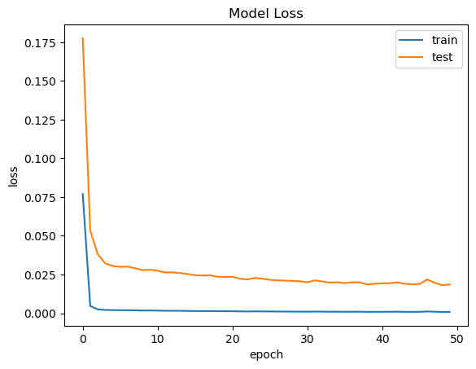
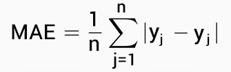

# Predict Bitcoin using Time Series in 2020 - 2023

# Project Domain
created by Harman Muhammad Satrio Reinaldy

## Background

The crypto and digital asset market, including Bitcoin, has attracted great interest in the last few years. The high level of volatility makes it important to be able to understand and predict Bitcoin price movements.

<p align="center">
  
  <br>
  Image 1 Bitcoin
</p>


This project aims to analyze Bitcoin prices using time series approaches and machine learning techniques. The problem to be solved is to identify and predict Bitcoin price movements based on historical time series data. This is important because the high volatility in the price of Bitcoin makes it difficult to predict future price movements.

The selection of this issue is based on the growth and popularity of Bitcoin as a cryptocurrency that has attracted the interest of many individuals and organizations. However, high and unpredictable price fluctuations pose a challenge for investors and market participants. By using a time series approach and machine learning techniques, such as LSTM (Long Short-Term Memory), you can utilize historical data to create predictive models that can identify trends and patterns of Bitcoin price movements. This can provide valuable insights to investors and market participants in making investment decisions related to Bitcoin.


# Business Understanding
The goal of this project is to analyze and predict Bitcoin price behavior based on historical data. This can help investors or market participants in making investment decisions related to Bitcoin.

## Problem Statements:
- How to overcome the challenges of dealing with high and unpredictable Bitcoin price volatility through a modeling approach using LSTM (Long Short-Term Memory) in a neural network?
- How to evaluate the performance of the LSTM model in predicting the price of Bitcoin using the Mean Absolute Error (MAE) evaluation metric and addressing overfitting or underfitting problems?
- How to utilize the MAE evaluation result information to determine the extent to which the LSTM model can provide accurate and reliable Bitcoin closing price forecasts to stakeholders?

## Goals:
- Develop a time series-based machine learning model using the LSTM (Long Short-Term Memory) algorithm that can produce Bitcoin closing price predictions with the lowest loss.

- Improve the performance of the prediction model by utilizing historical Bitcoin data from 3 years ago (2020-2022) to train the model.

- Provide more accurate and reliable Bitcoin closing price forecasts to stakeholders.
  

## Solution Statements:
- By using time series techniques and leveraging the LSTM's ability to recognize patterns and trends in data, it is expected that the model can capture the complex characteristics of Bitcoin price movements.
- The prediction model will be trained using historical Bitcoin data which includes information on previous closing prices, trading volumes, and other related data to increase prediction accuracy.
- This solution aims to provide more informational and strategic insights to investors and market participants in making investment decisions related to Bitcoin.

# Data Understanding
The data used in this project was obtained from [Yahoo Finance](https://finance.yahoo.com/). The data includes the following columns:

## Overview Dataset:
* The name of the dataset used is "Bitcoin Historical Data".
* This dataset contains historical data on Bitcoin price movements within a 3-year time span (2020-2022).
* The dataset contains 7 columns and 1097 rows.
* The amount of data in this dataset includes a number of observations (rows) that represent a certain period of time, and there are several attributes (columns) that include information, namely:
   * Date: The date of the observation.
   * Opening Price (Open): The opening price on that date.
   * High Price: The highest price on that date.
   * Low Price: The lowest price on that date.
   * Close Price: The closing price on that date.
   * Adjusted Price (Adj Close): The adjusted closing price (factors such as dividends, stock splits, etc. are taken into account).
   * Trading Volume (Volume): The number of transactions that occurred on that date.
* This dataset was collected to analyze and study Bitcoin price movements in the context of time series.

### Data Characteristics:
The data used in this project consists of historical Bitcoin price series over the previous 3-year period. The dataset includes thousands of data rows that represent the Bitcoin price on different dates. Each data row consists of information such as the opening price, highest price, lowest price, closing price, adjusted closing price (Adj Close), and trading volume on that day. With this information, it is possible to analyze Bitcoin price changes over time and identify trends, patterns, and price fluctuations. This dataset is the main basis for building a prediction model using a time series approach and the LSTM algorithm to predict the future closing price of Bitcoin.

# Data Preparation
## Data Preparation Technique

1. Techniques Used:

    - Data Scaling:
    The technique used is Min-Max Scaling or Normalization. This is done to change the range of data values to a smaller scale between 0 and 1. In this project, the MinMaxScaler function from the scikit-learn library is used to normalize the data.
    - Creation of Sequences:
    The technique used is the creation of sequences from time series data. Sequences are interrelated sequences of data within a specific time span. In this project, sequences are created using the create_sequences() function which will generate input sequences (X) and target outputs (y).
    - Dataset Distribution:
    The data is divided into two parts: training data and testing data. The proportion is 80% data for training and 20% data for testing. This is done to test the performance of the model on data that has never been seen before. The division of the dataset is done using slicing on the numpy array.


2. Explanation of Technique Stages:

    - Data Scaling:
    The library used is MinMaxScaler from ```sklearn.preprocessing```. This function is used to normalize the data by changing the range of values to be between 0 and 1. In this project, the scale of the data is adjusted to work well in the LSTM model.

    - Creation of Sequences:
    ```create_sequences(data, seq_length)``` function is used to form sequences from time series data. The data parameter is the data to be input, and ```seq_length``` is the desired sequences length. This function will produce two outputs, namely input sequences (X) and target output (y) in the form of a numpy array.
    
    - Dataset Distribution:
    At this stage, the dataset is divided into training data and testing data. The proportion is 80% for training data and 20% for testing data. This division is done using the slicing operation on the numpy array. The training data is used to train the model, while the testing data is used to evaluate the performance of the model.
    
    - Handling Outliers:
    In the given code example, no specific steps are taken to handle outliers. If required, special steps such as outlier detection and handling can be added at this stage using appropriate techniques and algorithms, such as outlier detection using statistical methods or the use of other models to handle anomalous data.

# Modeling
## The Modeling Approach
The approach used in this project is to use the LSTM (Long Short-Term Memory) model in a neural network to predict Bitcoin price based on historical time series data.

1. Proses dan Tahapan Pembuatan Model:

    a. Building Model Architecture:
    - The model used in this project is the Sequential model from TensorFlow's Keras API. This model architecture is built using the LSTM (Long Short-Term Memory) layer which is a special type of Recurrent Neural Network (RNN) that is effective in modeling time series data.
    - The first LSTM layer has 64 units with input shapes corresponding to the length of the ```sequences (seq_length)``` and the number of attributes (6).
    - A Dense layer with 6 units is used as the output layer, corresponding to the number of features in the dataset.

    b. Set Optimizer dan Learning Rate:
    - The optimizer used is the Adam optimizer. This optimizer is effective in adjusting the learning rate adaptively based on the gradient of the loss function.
    - The learning rate set is 0.001.
   
    c. Compile Model:
    - The model is compiled using an optimizer, loss function, and appropriate metric. The loss function used is MSE (Mean Squared Error) which is suitable for regression problems, and the metric used is MAE (Mean Absolute Error).
   
2. Algoritma yang Digunakan:

    - In the Modeling stage, the LSTM (Long Short-Term Memory) algorithm is used to model the Bitcoin time series data. LSTM is a type of RNN (Recurrent Neural Network) designed to overcome the vanishing gradient problem in traditional RNNs.
    - LSTM uses short-term memory and long-term memory to store information from previous data sequences. This allows the LSTM to capture long-term patterns in time series data.
    - In the given code, the LSTM model has one LSTM layer with 64 units, followed by a Dense layer with 6 units as the output layer.
   
3. Parameter yang Digunakan:

    - The number of units in the LSTM layer: 64.
    - Input shape at the LSTM layer: (seq_length, 6).
    - Number of units in the Dense output layer: 6.
    - Optimizer: Adam optimizer with learning rate 0.001.
    - Loss function: Mean Squared Error (MSE).
    - Metric: Mean Absolute Error (MAE).
    - The values of these parameters can be adjusted based on the needs and experiments conducted.


# Evaluation

<p align="center">
  
  <br>
  Image 2 Grafik Model Loss
</p>

First, look at the change in loss during the training process through the loss curve. If the loss decreases as the number of epochs increases, it indicates that the model is gradually learning patterns and information from the data.

Next, we look at whether the model is overfitting or underfitting through loss analysis. Overfitting occurs when the model is too complex and is able to "memorize" the training data very well, but is unable to generalize to new data. If overfitting occurs, look at the large difference between the loss on the training data and the validation or test data. Conversely, underfitting occurs when the model is too simple or not robust enough to capture complex patterns in the data. In this case, the loss on the training data and validation data is still high and there is no significant difference between the two.

The evaluation metric used in this project is Mean Absolute Error (MAE). MAE calculates the absolute difference between the actual and predicted values for each sample, and then takes the average of all the differences.

MAE Formula:
<p align="center">
  
  <br>
  Image 3 Rumus MAE
</p>

```
Description:
- MAE is Mean Absolute Error
- n is the number of samples or data points
- Σ shows the sum of each absolute difference between the prediction (y_pred) and the actual value (y_actual)
```

1. Evaluation Metrics Used:

 - The evaluation metric used is Mean Absolute Error (MAE).
 - MAE measures the average of the absolute difference between the predicted and ground truth values on the original scale.
 - This metric is useful for measuring the absolute error or deviation between model predictions and ground truth values. The lower the MAE value, the better the model performance.
   
2. Results of Applying Evaluation Metrics:

 - After going through the evaluation process, the results of applying the evaluation metric (MAE) can give an idea of how accurate the LSTM model is in predicting the Bitcoin value.
 - The MAE value obtained shows the average absolute error between the predicted value and the true value on the original scale.
 - The lower the MAE value, the better the performance of the model in predicting the value of Bitcoin.
 - In the given code, the MAE result is used to calculate the MAE percentage against the total scale of the data (total_scale). If the MAE percentage <= 10%, it can be said that the model has good performance.
 - Overall model evaluation can provide information about the extent to which the model can accurately predict Bitcoin price movements. The evaluation results can be used to evaluate and compare the performance of the model with other models, as well as to determine whether the model can meet the objectives and needs of the project.


## References

- Brownlee, J. (2018). Deep Learning for Time Series Forecasting: Predict the Future with MLPs, CNNs, LSTMs, and More. Machine Learning Mastery.
- Chollet, F. (2017). Deep Learning with Python. Manning Publications.
- Jason Brownlee's Machine Learning Mastery: _https://machinelearningmastery.com/_.
- Stock market data provided by Yahoo Finance: _https://finance.yahoo.com/_.
